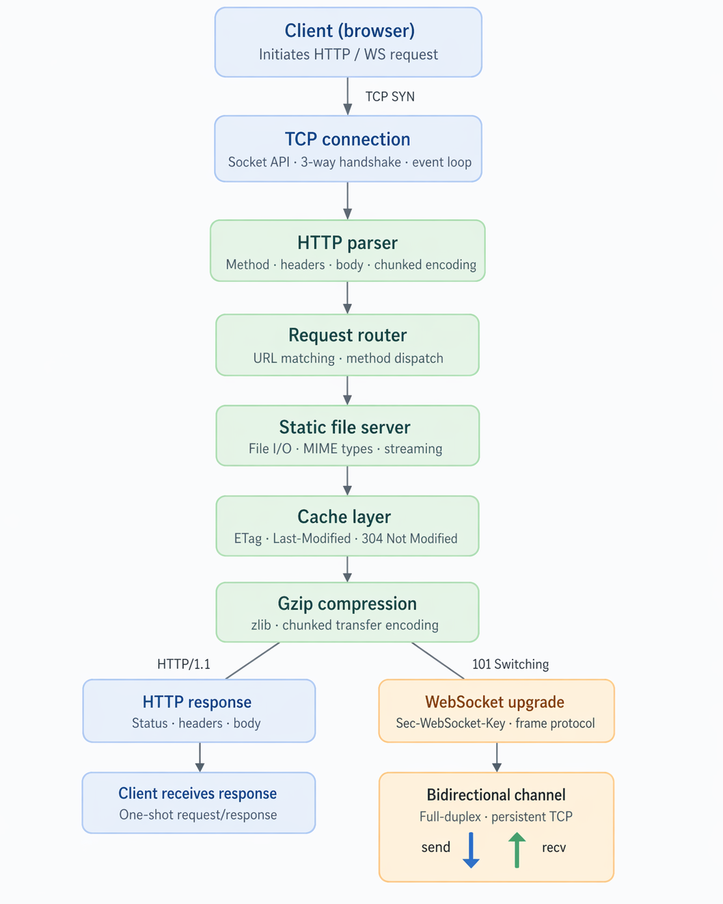

# My_Server

A low-level HTTP/1.1 and WebSocket server built with Node.js + TypeScript, implemented directly on top of raw TCP sockets (`net`) instead of Express or other frameworks.

This project is a hands-on systems-style implementation that demonstrates request parsing, response writing, keep-alive handling, streaming, range requests, basic caching, gzip support, and WebSocket frame processing.

## Implementation Workflow



## Features

- HTTP/1.0 and HTTP/1.1 request parsing with explicit header/body handling
- Keep-alive connection loop with graceful error and EOF handling
- Route handling in `src/main.ts`:
  - `GET /` (static file via cache-aware server)
  - `POST /echo` (echo request body)
  - `GET /sheep` (chunked streaming demo)
  - `GET /files/<path>` (static files with range + cache support)
  - `GET /health` (JSON health response)
- Static file serving with path sanitization to prevent traversal
- Conditional requests (`If-Modified-Since`) with `304 Not Modified`
- Byte-range requests (`206 Partial Content`)
- Optional gzip compression when client supports it
- WebSocket upgrade + frame handling (text/binary echo, ping/pong, close)

## Tech Stack

- Node.js (TCP with `net`)
- TypeScript (`strict` mode)
- No web framework dependencies

## Project Structure

- `src/main.ts` - primary HTTP server entry point and routing
- `src/http/` - HTTP parser and response writer
- `src/cache/` - cache-aware static file serving + range support
- `src/compression/` - gzip body wrapper and negotiation
- `src/websocket/` - handshake, frame protocol, queue, and WS connection loop
- `src/shared/` - TCP connection abstraction, dynamic buffer, shared HTTP types
- `src/streaming/` - chunked streaming helpers/generator
- `public/` - static assets served by `/` and `/files/*`
- `test.sh` - integration-style smoke test script

## Getting Started

### 1) Install dependencies

```bash
npm install
```

### 2) Build

```bash
npm run build
```

### 3) Run the server

```bash
npm start
```

Default host/port: `127.0.0.1:1234`  
You can override port:

```bash
PORT=8080 npm start
```

## Scripts

- `npm run build` - compile TypeScript to `dist/`
- `npm run build:watch` - compile in watch mode
- `npm run dev` - build then run server
- `npm start` - run compiled server

## Test

Run the smoke/integration checks:

```bash
npm run build
./test.sh
```

The test script starts the server on an available local port, validates key routes/behaviors, and shuts the server down automatically.

## Functionality Checks

Use these manual commands to verify server functionality while it is running on `127.0.0.1:1234`.

| What to test                | Command                                                                                                                                                                                                                                                             |
| --------------------------- | ------------------------------------------------------------------------------------------------------------------------------------------------------------------------------------------------------------------------------------------------------------------- |
| Basic GET                   | `curl -v http://127.0.0.1:1234/`                                                                                                                                                                                                                                    |
| POST echo                   | `curl -X POST --data "test" http://127.0.0.1:1234/echo`                                                                                                                                                                                                             |
| Static file                 | `curl http://127.0.0.1:1234/files/index.html`                                                                                                                                                                                                                       |
| Chunked stream              | `curl -N http://127.0.0.1:1234/sheep`                                                                                                                                                                                                                               |
| Range request               | `curl -H "Range: bytes=0-4" http://127.0.0.1:1234/files/hello.html`                                                                                                                                                                                                 |
| Gzip                        | `curl --compressed -v http://127.0.0.1:1234/files/hello.html`                                                                                                                                                                                                       |
| 304 cache                   | `LM="$(curl -s -D - -o /dev/null http://127.0.0.1:1234/files/hello.html \| awk -F': ' '/^Last-Modified:/{print $2}' \| tr -d '\r')"; echo "LM=[$LM]"; curl -o /dev/null -s -w "%{http_code}\n" -H "If-Modified-Since: $LM" http://127.0.0.1:1234/files/hello.html` |
| Health                      | `curl http://127.0.0.1:1234/health`                                                                                                                                                                                                                                 |
| WebSocket (browser console) | `const ws = new WebSocket("ws://127.0.0.1:1234/"); ws.onmessage = e => console.log(e.data); ws.onopen = () => ws.send("hi");`                                                                                                                                       |

## Docker Setup

The application is containerized using a multi-stage Docker build to ensure a small, secure production image.

**Build the image locally:**
```bash
docker build -t my_server .
```

**Run the container locally:**
```bash
docker run -p 3000:3000 my_server
```

## CI/CD Pipeline

This project uses **GitHub Actions** for Continuous Integration. The workflow automatically triggers on pushes and pull requests to the `main` branch. It ensures code quality by:
1. Installing dependencies.
2. Building the TypeScript project.
3. Running integration tests via `test.sh`.
4. Verifying the Docker image build.

## Notes

- This is an educational/learning-oriented server implementation focused on protocol understanding and clean architecture boundaries.
- Additional experimental servers are included under `src/tcp/`, `src/promises/`, and `src/protocol/`.
