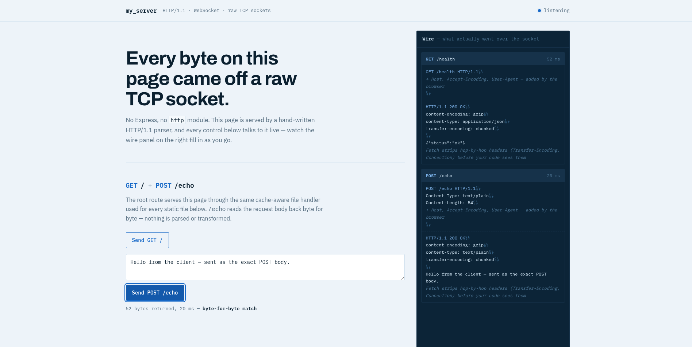
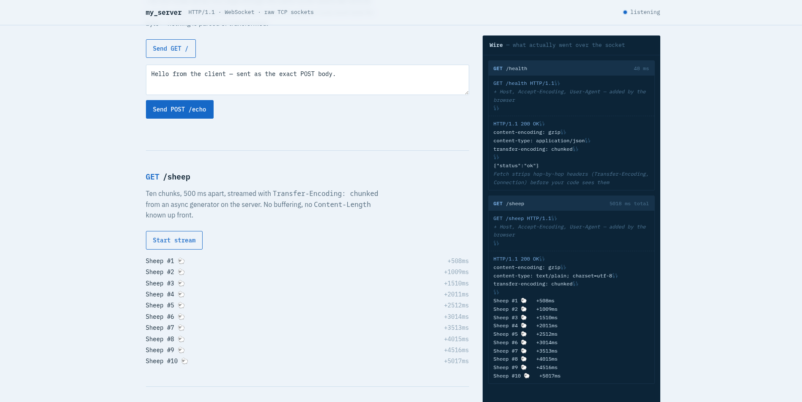
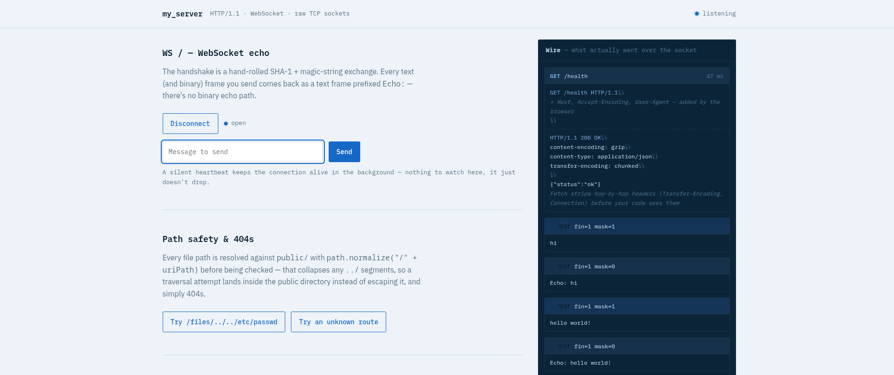
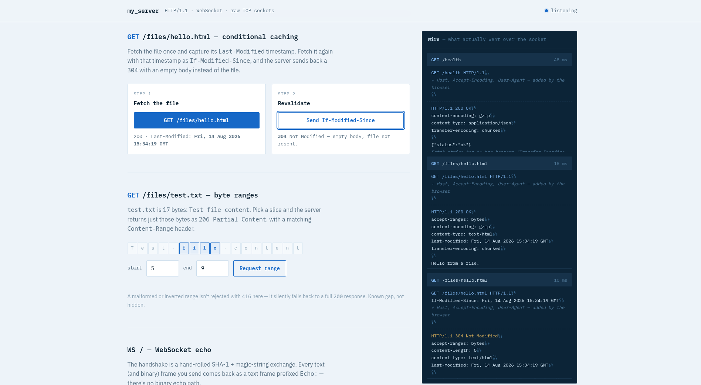
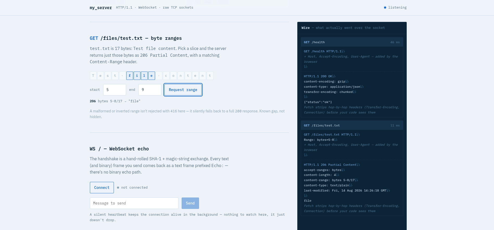
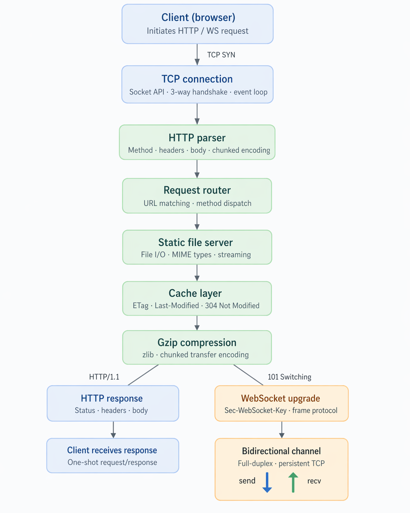

# my_server

[](https://github.com/RumeshChathuranga/my_server/actions/workflows/ci.yml)


A low-level HTTP/1.1 and WebSocket server built with Node.js + TypeScript, directly on
raw TCP sockets (`net`) — no Express, no `http` module, no WebSocket library. It parses
requests, frames responses, and handles keep-alive, streaming, byte ranges, conditional
caching, gzip, and the WebSocket handshake by hand, and it ships with a live demo page
that exercises every one of those behaviors against the running server.

## Contents

- [Demo](#demo)
- [Features](#features)
- [Architecture](#architecture)
- [Tech Stack](#tech-stack)
- [Project Structure](#project-structure)
- [Getting Started](#getting-started)
- [Scripts](#scripts)
- [Test](#test)
- [Verify It Yourself](#verify-it-yourself)
- [Docker Setup](#docker-setup)
- [CI/CD Pipeline](#cicd-pipeline)
- [Notes](#notes)

## Demo

The root route (`/`) serves a self-contained page — no build step, no dependencies — that
drives every route on the server live and shows the real request/response bytes as it
goes, instead of just describing them.



*The page doubles as a protocol inspector - every control drives a real request, with the
actual HTTP bytes shown alongside it as it happens.*



*`GET /sheep` streams ten chunks over `Transfer-Encoding: chunked` from an async
generator, 500&nbsp;ms apart - no `Content-Length`, no buffering, timed live in the
browser.*



*A hand-rolled WebSocket server - RFC&nbsp;6455 handshake, frame parsing, no `ws`
library - echoing messages in real time, with frame metadata (`fin`, `mask`, opcode) read
straight off the wire.*



*A second request for the same file, sent with `If-Modified-Since`, comes back
`304 Not Modified` with an empty body - the server never resends bytes the client
already has.*



*A `Range` request answered with `206 Partial Content` - the selected byte slice and the
exact `Content-Range` the server returned are both shown.*

## Features

- HTTP/1.0 and HTTP/1.1 request parsing with explicit header/body handling
- Keep-alive connection loop with graceful error and EOF handling
- Route handling in `src/main.ts`:
  - `GET /` - demo page, via the cache-aware static file server
  - `POST /echo` — returns the request body unchanged
  - `GET /sheep` — chunked streaming demo
  - `GET /files/<path>` — static files with range + conditional-cache support
  - `GET /health` — JSON health check
- Static file serving with path sanitization to prevent directory traversal
- Conditional requests (`If-Modified-Since`) answered with `304 Not Modified`
- Byte-range requests (`Range` → `206 Partial Content`)
- Gzip compression negotiated via `Accept-Encoding`
- WebSocket upgrade and frame handling (text/binary echo, ping/pong, close)

## Architecture



Every request moves through the same pipeline: the raw-socket parser reads it off the
wire, the router in `src/main.ts` dispatches by method and path, the cache/range layer
resolves file responses (or a route handler builds one directly), gzip is applied if the
client accepts it, and the writer frames the result back onto the socket. A WebSocket
upgrade is detected from the request headers and short-circuits straight to the frame
handler, ahead of the router.

## Tech Stack

- Node.js (TCP with `net`)
- TypeScript (`strict` mode)
- No web framework dependencies

## Project Structure

- `src/main.ts` - primary HTTP server entry point and routing
- `src/http/` - HTTP parser and response writer
- `src/cache/` - cache-aware static file serving + range support
- `src/compression/` - gzip body wrapper and negotiation
- `src/websocket/` - handshake, frame protocol, queue, and WS connection loop
- `src/shared/` - TCP connection abstraction, dynamic buffer, shared HTTP types
- `src/streaming/` - chunked streaming helpers/generator
- `public/` - static assets served by `/` and `/files/*`, including the demo page (`index.html`)
- `docs/` - [usage guide, API reference](docs/README.md), and screenshots
- `test.sh` - integration-style smoke test script

## Getting Started

### 1) Install dependencies

```bash
npm install
```

### 2) Build

```bash
npm run build
```

### 3) Run the server

```bash
npm start
```

Default host/port: `127.0.0.1:1234`  
You can override port:

```bash
PORT=8080 npm start
```

### 4) Open the demo page

Visit [http://127.0.0.1:1234/](http://127.0.0.1:1234/) — see [Demo](#demo) above for what
you'll find there, or [docs/demo-guide.md](docs/demo-guide.md) for the full walkthrough.

## Scripts

- `npm run build` - compile TypeScript to `dist/`
- `npm run build:watch` - compile in watch mode
- `npm run dev` - build then run server
- `npm start` - run compiled server

## Test

Run the smoke/integration checks:

```bash
npm run build
./test.sh
```

The test script starts the server on an available local port, validates key routes/behaviors, and shuts the server down automatically.

## Verify It Yourself

The screenshots above are real output, not mockups — these are the commands behind them,
runnable against the server on `127.0.0.1:1234`. Full behavior for every route (headers,
status codes, edge cases like the missing `416` on malformed ranges) is in
[docs/api-reference.md](docs/api-reference.md).

| What to test                | Command                                                                                                                                                                                                                                                             |
| --------------------------- | ------------------------------------------------------------------------------------------------------------------------------------------------------------------------------------------------------------------------------------------------------------------- |
| Basic GET                   | `curl -v http://127.0.0.1:1234/`                                                                                                                                                                                                                                    |
| POST echo                   | `curl -X POST --data "test" http://127.0.0.1:1234/echo`                                                                                                                                                                                                             |
| Static file                 | `curl http://127.0.0.1:1234/files/index.html`                                                                                                                                                                                                                       |
| Chunked stream               | `curl -N http://127.0.0.1:1234/sheep`                                                                                                                                                                                                                               |
| Range request                | `curl -H "Range: bytes=0-4" http://127.0.0.1:1234/files/hello.html`                                                                                                                                                                                                 |
| Gzip                         | `curl --compressed -v http://127.0.0.1:1234/files/hello.html`                                                                                                                                                                                                       |
| 304 cache                   | `LM="$(curl -s -D - -o /dev/null http://127.0.0.1:1234/files/hello.html \| awk -F': ' '/^Last-Modified:/{print $2}' \| tr -d '\r')"; echo "LM=[$LM]"; curl -o /dev/null -s -w "%{http_code}\n" -H "If-Modified-Since: $LM" http://127.0.0.1:1234/files/hello.html` |
| Health                       | `curl http://127.0.0.1:1234/health`                                                                                                                                                                                                                                 |
| WebSocket (browser console) | `const ws = new WebSocket("ws://127.0.0.1:1234/"); ws.onmessage = e => console.log(e.data); ws.onopen = () => ws.send("hi");`                                                                                                                                       |

## Docker Setup

The application is containerized using a multi-stage Docker build to ensure a small, secure production image. This single image serves both the demo frontend (`public/index.html`, at `/`) and the backend API/WebSocket routes — there's no separate frontend build or container, since one Node process handles both.

**Build the image locally:**
```bash
docker build -t my_server .
```

**Run the container locally:**
```bash
docker run -p 1234:1234 my_server
```

### Docker Compose

`docker-compose.yml` defines two services, matching the `start`/`dev` split above — both
serve the full app (frontend page + backend routes together):

- **`app`** — the production image (multi-stage build, no dev dependencies). Runs by
  default and includes a container healthcheck against `/health`.
  ```bash
  docker compose up app
  ```
  Visit `http://127.0.0.1:1234/`. Override the host port with `PORT=8080 docker compose up app`.

- **`dev`** — runs `src/main.ts` directly via `tsx watch`, no build step, with `src/` and
  `public/` bind-mounted so host edits restart the server live. Opt-in only, since it's a
  separate profile:
  ```bash
  docker compose up dev
  ```
  Visit `http://127.0.0.1:1235/` (a different default port so it can run alongside `app`;
  override with `DEV_PORT=...`).

## CI/CD Pipeline

This project uses **GitHub Actions** for Continuous Integration. The workflow automatically triggers on pushes and pull requests to the `main` branch. It ensures code quality by:
1. Installing dependencies.
2. Building the TypeScript project.
3. Running integration tests via `test.sh`.
4. Verifying the Docker image build.

## Notes

- This is an educational/learning-oriented server implementation focused on protocol understanding and clean architecture boundaries.
- Additional experimental servers are included under `src/tcp/`, `src/promises/`, and `src/protocol/`.
